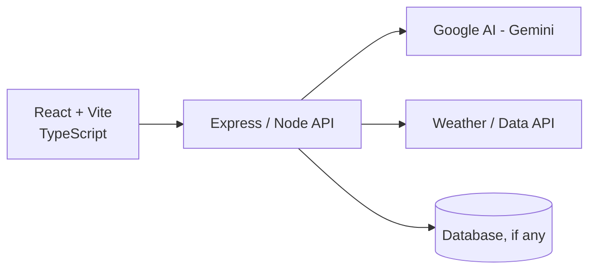
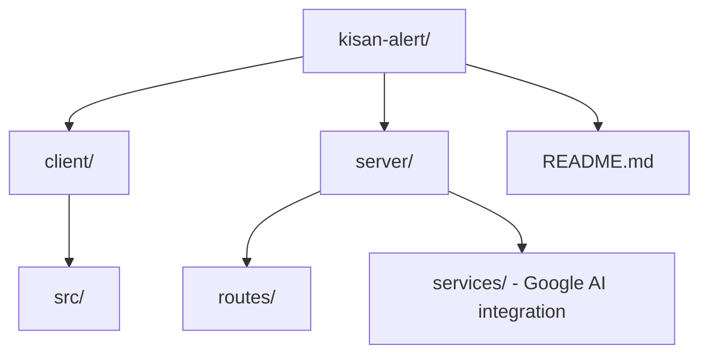

# 
Kisan Alert

**AI-powered crop advisory and farmer intelligence system for smallholder farmers in India.**

Built for the "Build with AI for Communities" hackathon (Google Cloud track).

[Live Demo](#) · [Pitch Deck](#) · [Report a Bug](../../issues)

---

## The Problem

Smallholder farmers in India often lack timely, localized access to crop health information,
weather-driven risk alerts, and actionable agronomic advice — the kind of guidance that larger
commercial farms get from agronomists or expensive advisory services. Language barriers,
low connectivity, and fragmented information sources make this worse.

## What Kisan Alert Does

Kisan Alert gives smallholder farmers a simple way to get **AI-generated crop advisoryp**
based on their location, crop type, and current conditions — surfaced through a lightweight
web interface designed for low-bandwidth, low-literacy contexts.

- **Localized advisory** — location and crop-specific recommendations
- **Risk alerts** — weather/pest/disease risk flagged proactively
- **[Multilingual support]** — advisory delivered in [languages supported]
- **AI-generated guidance** — powered by Google AI (Gemini) for natural-language advisory generation
- **[Dashboard/history]** — farmers can track past advisories and outcomes

> Fill in / trim the above to match what's actually implemented vs. planned.

## Architecture



**Frontend:** React, TypeScript, Vite
**Backend:** Express / Node.js
**AI layer:** Google AI (Gemini API) for advisory generation
**Deployment:** Google Cloud Run
**[Data sources]:** [e.g. weather API, soil data, crop database]

## Why These Choices

A few notes on tradeoffs, since this is often what gets asked in review:

- **Vite over CRA** — faster dev iteration, smaller bundle for low-bandwidth users
- **Express over a heavier framework** — kept the API surface small and easy to reason about for a hackathon timeline, though [note here if you'd reconsider this for scale]
- **Gemini for advisory generation** — chosen for [cost / Google Cloud alignment / multimodal support]; tradeoff is [latency / cost per call / rate limits] which is mitigated by [caching / batching / etc., if applicable]
- **Cloud Run for deployment** — scales to zero, keeps cost near-zero for a project with sporadic hackathon-demo traffic, and keeps it aligned with the Google Cloud track

## Getting Started

### Prerequisites
- Node.js 18+
- A Google AI API key ([get one here](https://ai.google.dev/))
- [Any other API keys — weather, maps, etc.]

### Installation

```bash
git clone https://github.com/[your-username]/kisan-alert.git
cd kisan-alert
npm install
```

### Environment Variables

Create a `.env` file in the root:

```
GOOGLE_AI_API_KEY=your_key_here
[OTHER_API_KEY]=your_key_here
PORT=3000
```

### Running Locally

```bash
# Start the backend
cd server
npm run dev

# In a separate terminal, start the frontend
cd client
npm run dev
```

Visit `http://localhost:5173` (or your Vite port).

### Deployment (Cloud Run)

```bash
gcloud builds submit --tag gcr.io/[project-id]/kisan-alert
gcloud run deploy kisan-alert --image gcr.io/[project-id]/kisan-alert --platform managed
```

## Project Structure



## Roadmap

- [ ] SMS/WhatsApp-based alert delivery for farmers without reliable data access
- [ ] Voice-input for low-literacy users
- [ ] Offline-first PWA support
- [ ] Expanded crop/region coverage
- [ ] [Whatever you pick as your "one new feature" before applying]

## Testing

```bash
npm test
```

> [Fill in actual coverage — even a handful of meaningful tests on the AI-response parsing or API routes is worth noting explicitly here.]

## Contributing

This started as a hackathon project but is open to contributions. Please open an issue before
submitting a PR for anything beyond small fixes.

## License

[MIT / Apache 2.0 / etc.]

## Acknowledgments

Built for the "Build with AI for Communities" hackathon, Google Cloud track.
